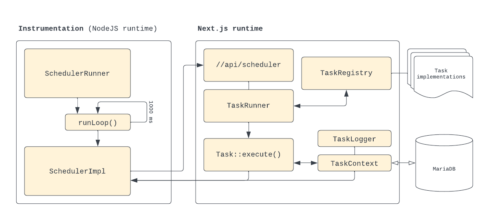

# Volunteer Manager Scheduler
The Volunteer Manager features a task scheduler to be able to execute tasks, either as one-offs or at a repeated interval. Execution is fully instrumented and logged for display in the administration area. The system is designed to be resilient against errors, and to cleanly recover, without any side effects, by restarting the Docker image as a last resort.

Tasks are identified either by their name ("_ephemeral tasks_") or by a unique Task ID that exists in the database. Tasks always have a scheduled time for execution, and optionally an `interval` at which they will automatically be rescheduled after invocation—regardless of execution result. Tasks can be executed with parameters, which will be validated prior to being consumed.

Tasks can be scheduled by registering the task in the database, then calling [`Scheduler::queueTask()`](Scheduler.ts) from either runtime. It's valid for there to not be a delay at all. Tasks are expected to provide (static) utility methods for convenient scheduling, such as `MyTask::Schedule(...)`.

## Instrumentation - NodeJS Runtime
The scheduler runtime is initialised at server bootstrap using the Next.js [instrumentation](https://nextjs.org/docs/app/building-your-application/optimizing/instrumentation) feature.

[`instrumentation.ts`](../../../instrumentation.ts), invoked by Next.js, initialises the [`SchedulerRunner`](SchedulerRunner.ts) which runs in a perpetual loop while the server is running. Attached to the runner are one or more [`Scheduler`](Scheduler.ts) instances, which is implemented as [`SchedulerImpl`](SchedulerImpl.ts) for production purposes. Whenever a task is due to fire a request will be issued to a Next.js API endpoint.

The `SchedulerImpl` issues requests to the [/api/scheduler](../../api/scheduler/route.ts) endpoint, and uses a static password to confirm that requests indeed originate from within our system. Only the task name or ID are communicated, beyond those the `SchedulerImpl` is largely stateless.

The `SchedulerRunner` will automatically queue a [`PopulateSchedulerTask`](./tasks/PopulateSchedulerTask.ts) whenever a new `Scheduler` is attached, which synchronises the queued tasks with the state in the database.

The `SchedulerRunner` features exponential back-off when exceptions are seen in the system. The most likely cause for these will be network issues.

## Next.js Runtime
Once requests are received by the API, they will be handed off to the [`TaskRunner`](TaskRunner.ts). It _(a)_ retrieves the appropriate task from the [`TaskRegistry`](TaskRegistry.ts), then _(b)_ creates a new [`TaskContext`](TaskContext.ts), then _(c)_ executes the task.

The `TaskRunner` will require (zod) validation of parameters for tasks that accept them. Such parameters are always stored in the database.

The `TaskContext` is able to initialise task information from the database, and will write back execution information to the database as well. We store an execution result, runtime duration and any number of logs. It further is able to (re)schedule the next invocation for repeating tasks, and does so in a transaction to ensure the system can recover from failures.

## Alternatives considered
There are many excellent task queue systems available out there, often open source and/or for a reasonable fee. The two main constraints for the AnimeCon Volunteer Manager are to minimise dependencies on external services, and to be able to execute basic immediate and scheduled tasks. We thus require a self-hosted solution optimising for maintainability for these core cases.

  * _Cron_ is super reliable, but is limited to minute granularity by default.
  * [Inngest](https://www.inngest.com/) does not support self hosting.
  * [Quirrel](https://quirrel.dev/) seems unmaintained since Netlify acquired it.
  * [Trigger](https://trigger.dev/) supports self hosting but required PostgreSQL.
